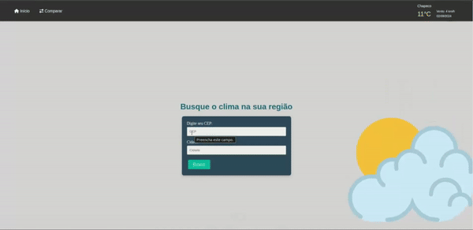

# Weather Challenge

**Weather Challenge** é uma aplicação web desenvolvida em Laravel que permite visualizar dados climáticos, salvar registros de clima e compara-los.

## Tecnologias Usadas

- **Laravel**: Framework PHP para desenvolvimento de aplicações web.
- **jQuery**: Biblioteca JavaScript para manipulação e requisições.
- **Carbon**: Biblioteca PHP para manipulação de datas e horários.
- **MySQL**: Sistema de gerenciamento de banco de dados relacional.
- **Composer**: Gerenciador de dependências.
- **Hashids**: Encode e decode de informações.
- **SASS**: Pré-processador CSS para escrever estilos de forma mais simples.
- **Docker**: Plataforma para criar, implantar e executar aplicações em contêineres.
- **PhpMyAdmin**: Ferramenta web para gerenciamento de bancos de dados MySQL.
- **PhpUnit**: Desenvolvimento dos testes para garantir confiabilidade do código.

## Padrões Utilizados

1. **MVC (Model-View-Controller)**: Padrão do Framework utilizado.

2. **Services**: Utilizado para organizar conexões com API's externas.

3. **CamelCase**: Definições de veriáveis PHP e JavaScript.

# Meu Projeto

Aqui está um GIF que demonstra a funcionalidade do projeto:

